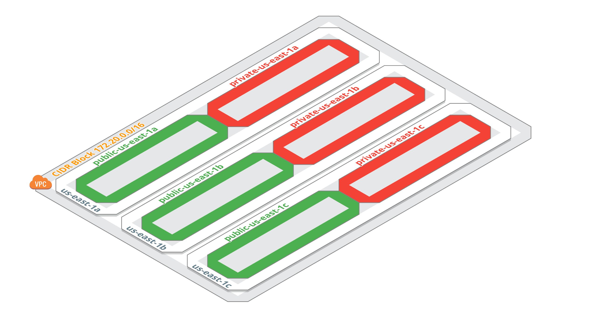
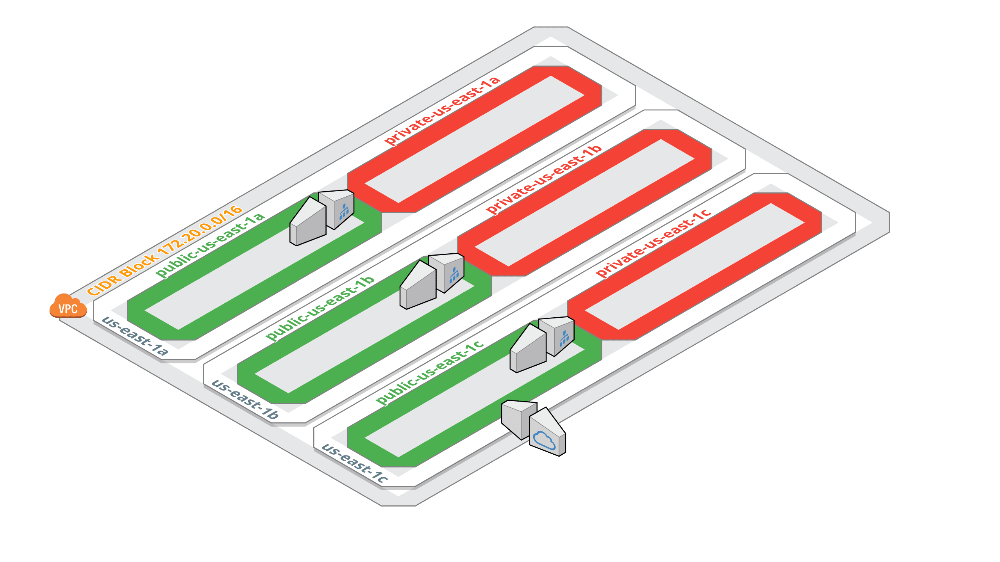

# Terraform AWS VPC

## :package: Install Terraform

Install Terraform by following the [documentation](https://www.terraform.io/downloads.html)

Make sure `terraform` is working properly

```hcl
$ terraform
Usage: terraform [--version] [--help] <command> [args]

The available commands for execution are listed below.
The most common, useful commands are shown first, followed by
less common or more advanced commands. If you're just getting
started with Terraform, stick with the common commands. For the
other commands, please read the help and docs before usage.

Common commands:
    apply              Builds or changes infrastructure
    console            Interactive console for Terraform interpolations
# ...
```

*Based on [standard module structure](https://www.terraform.io/docs/modules/create.html#standard-module-structure) guidelines*

## 1. Create a `VPC`

The really first stage for bootstrapping an AWS account is to create a `VPC`


## 2. Create `public` and `private` Subnets



## 3. Create `internet` and `nat` Gateways



## 4. Create `route tables` and `routes`


